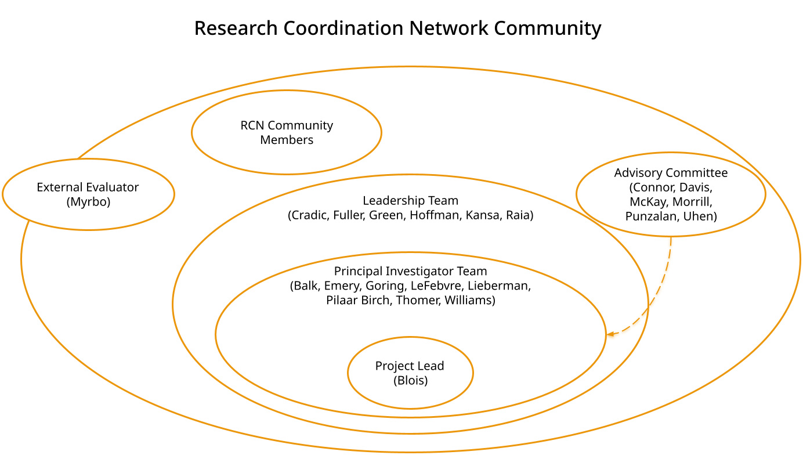
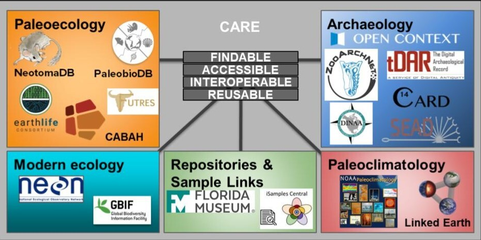

    

      <h1 style="font-size:calc(20px + 3vw);align-self:start;">Meet our Team</h1>
      
Our team is always evolving as we broaden our network of participants. However, our shared commitment to building an ethical open scientific community remains constant. 

    

    

      <figure id="stakes">
        
        <figcaption></figcaption>
      </figure>
    

  

  

  <h2 style="color:#42b7bf;margin-bottom:0px; background-color:#fff;z- index:9;position:relative;overflow:visible; border-bottom:1px solid #ec970b;width:100%">The Principal Investigators</h2>
  

  

  
    
        

          

            <a href= {{ team_member.orcid }} style="font-size:15px;font-weight:bold;">{{ team_member.name }}</a>
            
{{ team_member.role }}

            
{{ team_member.email }}

            
{{ team_member.institution }} 

          

          
          

            
            
            
            
            
          

        

     
  

   
   

  <h2 style="color:#42b7bf;margin-bottom:0px; background-color:#fff;z- index:9;position:relative;overflow:visible; border-bottom:1px solid #ec970b;width:100%">Other Project Leaders</h2>
  

  

  
    
        

          

            
{{ team_member.name }}

            
{{ team_member.role }}

            
{{ team_member.institution }} 

          

          
          

            
          

        

     
  

 
  

   <h2 style="color:#42b7bf;margin-bottom:0px; background-color:#fff;z-index:9;position:relative;overflow:visible; border-bottom:1px solid #ec970b;width:100%;">The Advisory Committee</h2>
  

  

  
      
        

          

            
{{ advise_member.name }}

            
{{ advise_member.institution }}

          

          
          

            
          

          
        

       
  

  

  <h2 style="color:#42b7bf;margin-bottom:0px; background-color:#fff;z- index:9;position:relative;overflow:visible; border-bottom:1px solid #ec970b;width:100%">Related Repositories</h2>
  

  

   
  <map name="repomap">
  <area shape="rect" coords="26,62,118,123" alt="Neotoma" href="https://www.neotomadb.org/">
  <area shape="rect" coords="210,38,300,125" alt="PBDB" href="https://paleobiodb.org/#/">
  <area shape="rect" coords="28,162,114,253" alt="EarthLife" href="https://earthlifeconsortium.org/">
  <area shape="rect" coords="125,190,195,270" alt="Cabah" href="https://epicaustralia.org.au/">
     <area shape="rect" coords="208,170,310,220" alt="futres" href="https://futres.org/">
    <area shape="rect" coords="40,337,166,394" alt="neon" href="https://www.neonscience.org/">
    <area shape="rect" coords="181,375,292,440" alt="gbif" href="https://www.gbif.org/">
    <area shape="rect" coords="320,362,489,410" alt="flmnh" href="https://www.floridamuseum.ufl.edu/">
    <area shape="rect" coords="504,363,608,445" alt="isample" href="https://isamplesorg.github.io/home/">
    <area shape="rect" coords="630,56,905,95" alt="opencontext" href="https://opencontext.org/">
    <area shape="rect" coords="630,90,733,190" alt="zan" href="https://zooarchnet.org/">
    <area shape="rect" coords="753,94,905,155" alt="tdar" href="https://core.tdar.org/">
    <area shape="rect" coords="636,198,721,281" alt="dinaa" href="https://alexandriaarchive.org/dinaa/">
    <area shape="rect" coords="759,165,880,210" alt="card" href="https://www.canadianarchaeology.ca/">
    <area shape="rect" coords="739,220,901,276" alt="sead" href="https://www.sead.se/">
        <area shape="rect" coords="655,335,775,444" alt="noaa" href="https://www.ncei.noaa.gov/products/paleoclimatology">
    <area shape="rect" coords="784,330,917,439" alt="lipd" href="https://lipd.net/">
</map>
  

  
  
 
